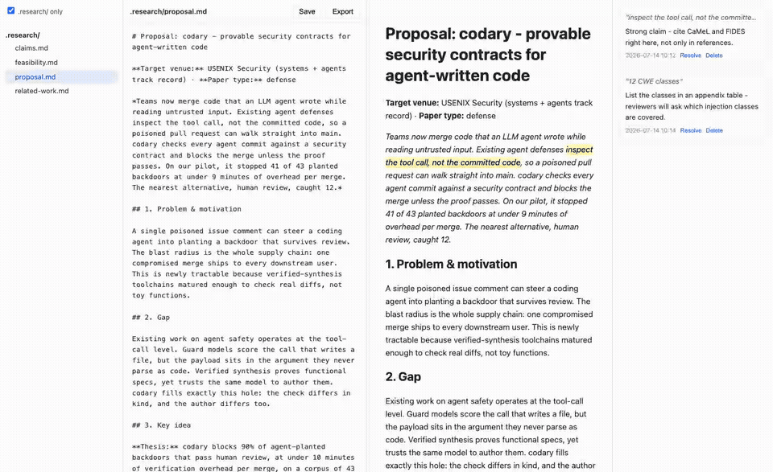
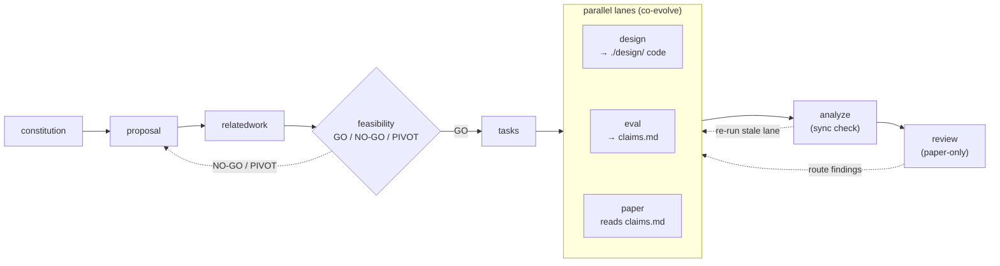
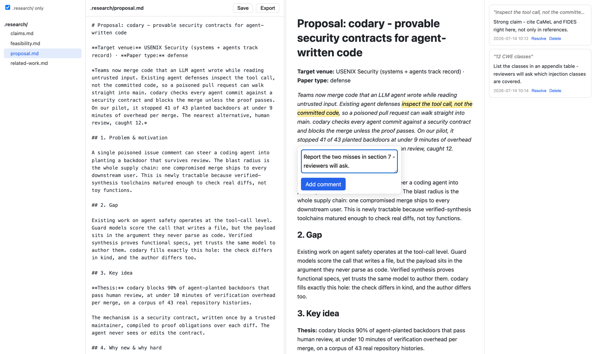
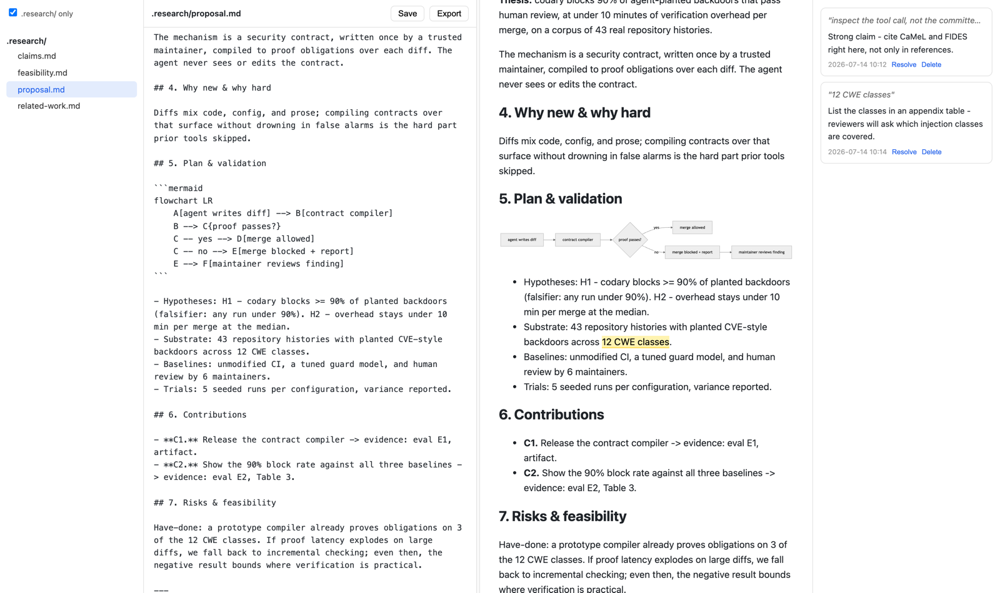

<div align="center">

# 🔬 research-kit

### *Spec-Driven Development for research papers.*

**A pipeline of slash commands for your AI coding agent — Claude Code, Codex CLI, or GitHub Copilot CLI.
Every stage of paper writing becomes one reviewable artifact on disk. Pure Markdown: no build step, no lock-in.**

[](LICENSE)
[](https://github.com/jiancui-research/research-kit/commits/main)
[](#-supported-agents)
[](#-quickstart)
[](https://github.com/jiancui-research/research-kit/stargazers)

[Quickstart](#-quickstart) · [Commands](#-commands) · [Review UI](#-the-review-ui-researchmdreview) · [Workflow docs](docs/workflow.md) · [Design](docs/design.md)



*The bundled review UI: Overleaf-style split view, click-to-source sync, Google-Docs-style comments, one-click export to any AI — [details below](#-the-review-ui-researchmdreview).*

</div>

---

## 🤔 Why

Asking one giant "write my paper" prompt produces plausible slop and hidden overclaims. research-kit splits the work the way strong labs do:

- **One command per stage, one artifact per command.** Each stage reads what came before, takes your steering, and writes a single reviewable document under `./.research/` — your decision record, committed with the paper.
- **A kill-switch before you over-invest.** `feasibility` runs one small probe and returns **GO / NO-GO / PIVOT** before the full build.
- **Claims that can't drift from evidence.** The build (`design`), evaluation (`eval`), and writing (`paper`) lanes co-evolve in parallel, synced only through a claim ↔ evidence matrix (`claims.md`); `analyze` catches drift and names the exact re-run, and `review` simulates a reviewer panel reading only the paper.

## 🗺️ The pipeline



After feasibility, `tasks` fans out into three parallel lanes that co-evolve: **design** builds the system (code), **eval** evaluates it, **paper** writes it up. The design lane is paper-type aware — heavy for systems/defense, skipped for measurement / SoK. Auxiliary commands: `rebuttal` (post-submission), `ae` (artifact evaluation), and `mdreview` (the review UI below). Run any subset, re-run any stage as your work evolves; commands only touch their own artifacts and never overwrite silently.

📐 **[Workflow diagram + per-command inputs/outputs →](docs/workflow.md)**

## ⚡ Quickstart

**Claude Code — plugin (recommended, no script):**

```text
/plugin marketplace add jiancui-research/research-kit
/plugin install research-kit@research-kit
```

Plugin stages are namespaced, e.g. `/research-kit:research.proposal …`; update later with `/plugin marketplace update`.

**GitHub Copilot CLI — plugin (no script):**

```text
copilot plugin marketplace add jiancui-research/research-kit
copilot plugin install research-kit@research-kit
```

Copilot reads the same `.claude-plugin` bundle directly, exposing the namespaced `/research-kit:research.*` stages; update later with `copilot plugin update research-kit`.

**Any agent — script:**

```sh
./install.sh            # Claude Code (default). Also: --codex, --copilot, --all
```

Then, in your paper repo, start with `/research.init` and follow the pipeline — each command writes its result into `./.research/` and suggests the next one. (Plugin installs prefix every command with `research-kit:`.)

<details>
<summary><b>The full run, stage by stage</b></summary>

```sh
/research.init                       # once per repo: copy templates into .research/
/research.constitution <focus>       # optional: set writing voice + venue
/research.proposal <your raw idea>   # pipeline entry
/research.relatedwork
/research.feasibility
/research.tasks                      # writes three plans: design, eval, paper
/research.design                     # build-papers only: implement the system into ./design/
/research.eval                       # evaluate the build; runs parallel with paper, synced via claims.md
/research.paper
/research.analyze                    # also a "sync" check: what drifted, what to re-run
/research.review
```

</details>

## 🧩 Commands

| Command | What it does |
| --- | --- |
| `/research.init` | Copy the bundled templates into this paper repo's `.research/templates/` (run once per repo, after `install.sh`). |
| `/research.constitution` | Establish or update the research constitution: quality principles, writing voice, and venue norms. |
| `/research.proposal` | Pipeline entry: turn a raw idea into a readable 1-3 page argument (falsifiable thesis, argued gap, pre-committed validation plan, venue and paper type). |
| `/research.relatedwork` | Survey prior work into `related-work.md` and sharpen the proposal's gap and positioning. |
| `/research.feasibility` | De-risk the central result with a quick probe and return a GO / NO-GO / PIVOT verdict before you invest in the full build. |
| `/research.tasks` | Produce three paper-type-aware plans: the design/build plan, the eval plan, and the paper task list (READY vs blocked-on-claim). |
| `/research.design` | Build lane (build-papers only): implement the system from `tasks/design.md` into actual code in the project's `./design/` folder. Skipped for measurement / SoK. |
| `/research.eval` | Run the eval tasks that evaluate the built system and keep the claim-evidence matrix current. |
| `/research.paper` | Human-led writing: outline a section or critique your draft, every claim traceable to the evidence matrix; System Design sourced from `tasks/design.md`. |
| `/research.analyze` | Read-only cross-artifact audit **and** the sync checker across the design/eval/paper lanes: flags drift and names the exact re-run. Outputs a prioritized gap report. |
| `/research.review` | Simulate a reviewer panel reading **only the paper**: mock reviews + scores, plus a suggested fix command per finding; you route them and loop until clean. |
| `/research.rebuttal` | Draft a prioritized, evidence-backed rebuttal to reviewer comments, fitted to the venue word limit. |
| `/research.ae` | Prepare an artifact-evaluation submission: reproducibility checklist, artifact README, badge plan, archival link. |
| `/research.mdreview` | Open a local web UI to read, edit, comment on, and export the repo's markdown (optional; requires `uv`). Comments are sidecar JSON in `./.mdreview/` any agent can read. |

## 🖥️ The review UI (`/research.mdreview`)

Read, edit, comment on, and export your paper's markdown in a local web UI — one file, localhost only, nothing beyond `uv` to install. (Demo GIF at the top of this page.)

- ✂️ **Overleaf-style split view** — raw markdown left, rendered preview right, draggable divider; the preview re-renders live as you type.
- 🎯 **Click-to-source sync** — click or double-click anything in the rendered pane and the cursor jumps to (and selects) the matching spot in the raw editor; the **Reveal →** button blinks the preview text matching your cursor.
- 💬 **Google-Docs-style comments** — select rendered text and attach a note. Comments live as sidecar JSON under `./.mdreview/`, so your markdown stays clean and any coding agent can read them in-repo: *"read `.mdreview/` and address the comments on proposal.md"*.
- 📋 **One-click export** — copies the document plus open comments to the clipboard, ready to paste into any AI for review.
- 🧜 **Mermaid diagrams** — ` ```mermaid ` fences render as diagrams with a zoom + pan lightbox (via CDN; they fall back to code blocks offline).
- 🔒 **Safe saves** — atomic writes with a conflict guard for when the file changed on disk mid-review (say, an agent edited it), plus a `.research/ only` sidebar filter that keeps the focus on the tracking docs.

| Comment on a selection | Click-to-source sync + mermaid |
| --- | --- |
|  |  |

Launch from any repo: `/research.mdreview` in your agent, or directly `uv run tools/mdreview.py --open`.

## 🤖 Supported agents

The same pipeline installs for three agents; pick one or more (`--all` for every one; default is Claude Code).

| Agent | Install | How you invoke a stage |
| --- | --- | --- |
| **Claude Code** (plugin) | `/plugin install research-kit@research-kit` | `/research-kit:research.proposal <text>` |
| **Claude Code** (script) | `./install.sh` | `/research.proposal <text>` |
| **Codex CLI** | `./install.sh --codex` | `/research.proposal <text>` |
| **GitHub Copilot CLI** (plugin) | `copilot plugin marketplace add jiancui-research/research-kit` → `copilot plugin install research-kit@research-kit` | `/research-kit:research.proposal <text>` |
| **GitHub Copilot CLI** (script) | `./install.sh --copilot` | `/agent` → pick `research.proposal`, then type your input |

<details>
<summary><b>Per-agent notes (Copilot bundle, Codex marketplace, self-pruning, overrides)</b></summary>

- **Copilot** installs the same `.claude-plugin` bundle straight from its marketplace (`copilot plugin marketplace add …` → `copilot plugin install research-kit@research-kit`), reading `commands/` directly — no script needed. The `./install.sh --copilot` path stays as an alternative that instead generates `*.agent.md` custom agents (invoked via `/agent`).
- **Codex** has its own plugin marketplace, but it expects a skill-based Codex plugin (`.agents/plugins/marketplace.json` + `.codex-plugin/`), not the `.claude-plugin` bundle — so Codex uses the script, which installs the commands into `~/.codex/prompts/` as native `/research.*` slash commands.
- **Self-pruning & overrides.** Re-running `install.sh` removes commands deleted from the bundle. Override destinations with `CLAUDE_COMMANDS_DIR` / `CODEX_PROMPTS_DIR` / `COPILOT_AGENTS_DIR` (or `CODEX_HOME`); `--symlink` links instead of copies; `--uninstall` removes everything.

</details>

## 📁 Working directory

The project is one repo (under `~/Projects`, outside the vault). research-kit's **tracking docs** all live under `./.research/` — commit it alongside the paper as the decision record. The actual **work products** (code, data, paper source) live in sibling root folders.

<details>
<summary><b>Full layout</b></summary>

```
<project>/                 one repo under ~/Projects, outside the vault
  .research/               all research-kit tracking docs:
    memory/constitution.md   research principles + writing voice
    templates/               skeletons + craft guides (from /research.init)
    proposal.md              problem, NABC, gap, contributions, RQs, venue, paper type
    related-work.md          prior work + positioning
    feasibility.md           de-risk probe + GO / NO-GO / PIVOT
    tasks/design.md          system architecture + project layout + build tasks (build-papers)
    tasks/eval.md            evaluation design + eval task list
    tasks/paper.md           paper section tasks (READY vs blocked-on-claim)
    claims.md                claim ↔ evidence matrix (the shared sync point)
    analyze-report.md        prioritized gap + sync report
    review/ rebuttal/ ae/    outputs of those commands
  feasibility/             throwaway probe code
  design/                  the system code (built by /research.design)
  eval/                    eval writeups + index + scripts, data, results
  paper/                   outlines, drafts, and the manuscript source (LaTeX, figures)
```

</details>

## 🎨 Customization

`.research/memory/constitution.md` sets the quality bar, writing voice, and venue norms every command reads first — edit it directly or via `/research.constitution`. Several commands are paper-type aware (measurement, attack, defense, benchmark, SoK); the skeletons and craft guides live in `templates/` and are copied in by `/research.init`.

## 🤝 Contributing

See [CONTRIBUTING.md](CONTRIBUTING.md). Keep it simple, keep the pipeline consistent, and write original, generalizable guidance.

## 🙏 Credits & license

Inspired by [GitHub spec-kit](https://github.com/github/spec-kit) (MIT), which brought Spec-Driven Development to software. MIT licensed — see [LICENSE](LICENSE).
