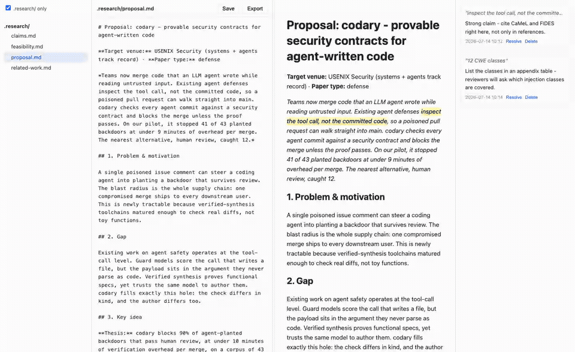
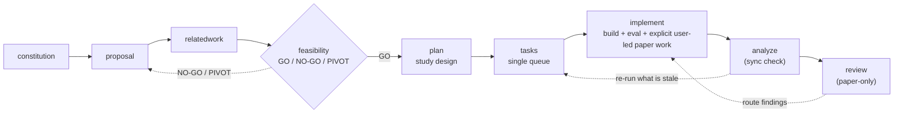
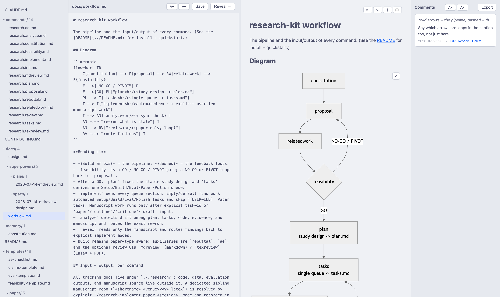
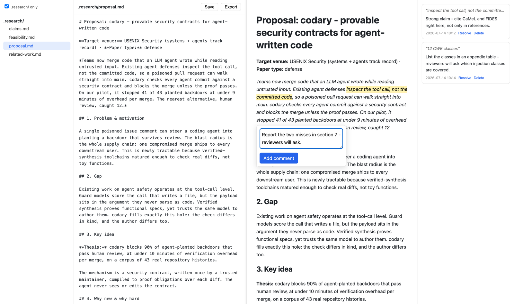
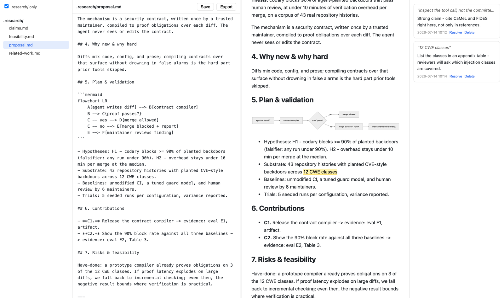
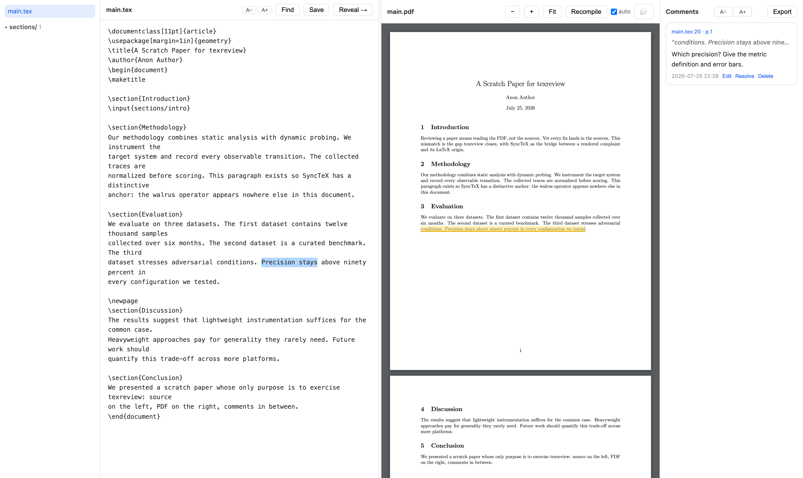

<div align="center">

# 🔬 research-kit

### *Do research in documents, not code.*

**Spec-Driven Development for research papers: a pipeline of slash commands for your AI coding agent — Claude Code, Codex CLI, GitHub Copilot CLI, or Oh My Pi (OMP).
Every stage produces one reviewable Markdown document. The documents are what you check; the code is written from them.**

[](LICENSE)
[](https://github.com/jiancui-research/research-kit/commits/main)
[](#-supported-agents)
[](#-quickstart)
[](https://github.com/jiancui-research/research-kit/stargazers)

[Quickstart](#-quickstart) · [Commands](#-commands) · [Review UI](#-the-review-ui-researchmdreview) · [Workflow docs](docs/workflow.md) · [Design](docs/design.md)



*The bundled review UI: Overleaf-style split view, click-to-source sync, Google-Docs-style comments, one-click export to any AI — [details below](#-the-review-ui-researchmdreview).*

</div>

---

## 🤔 Why

The document is the only thing you, the researcher, need to check — the code gets written from it.

- **You review documents, never code.** Every stage produces one Markdown doc under `./.research/` — the spec, the record, and the thing you actually check. The implementation plan derives from these docs, the agent builds from the plan, and results flow back into `claims.md` and the draft, where you judge them.
- **Each document is iterated, not just generated.** You refine it with your AI as advisor and peer — critiques, comments, replies — plus your own edits, until it says what you mean. Only then does the next stage build on it.
- **A kill-switch and a drift-catcher keep it honest.** `feasibility` returns **GO / NO-GO / PIVOT** before you over-invest; `analyze` catches the lanes drifting from the docs and names the exact re-run; `review` simulates a reviewer panel reading only the paper.

Checking and refining documents is the whole job — which is why research-kit bundles [mdreview](#-the-review-ui-researchmdreview) to make it comfortable.

## 🗺️ The pipeline

research-kit follows the workflow strong research already follows: sharpen an idea into a falsifiable proposal, position it, pilot the riskiest assumption, plan the study, derive one queue, then build, evaluate, and work on the manuscript through one executor before review. Each step stays explicit and checkable:


```mermaid
flowchart LR
    C[constitution] --> P[proposal] --> RW[relatedwork] --> F{feasibility<br/>GO / NO-GO / PIVOT}
    F -.->|NO-GO / PIVOT| P
    F -->|GO| PL["plan<br/>study design"]
    PL --> T["tasks<br/>single queue"]
    T --> I["implement<br/>build + eval + explicit user-led paper work"]
    I --> A["analyze<br/>(sync check)"] --> R["review<br/>(paper-only)"]
    A -.->|re-run what is stale| T
    R -.->|route findings| I
```

Why this shape: every stage ends in a Markdown document under `./.research/` that you review before the next stage builds on it. After feasibility's GO, `plan` fixes the stable study design and `tasks` derives one queue. `implement` owns that queue: it builds code, runs evals, updates `claims.md`, and assists with `[USER-LED]` manuscript tasks only when you explicitly select them. Empty/default runs never start manuscript work. The Build section remains paper-type aware; `rebuttal` and `ae` are auxiliary.

📐 **[Workflow diagram + per-command inputs/outputs →](docs/workflow.md)**

## 🖥️ The review UI (`/research.mdreview`)

Checking and editing that pipeline of docs *is* the workflow — so research-kit bundles **mdreview** to make the loop painless: a local web UI over your repo's markdown. One file, localhost only, nothing beyond `uv` to install.



- ✂️ **Overleaf-style split view** — raw markdown left, rendered preview right, draggable divider; the preview re-renders live as you type.
- 🎯 **Click-to-source sync** — click or double-click anything in the rendered pane and the cursor jumps to (and selects) the matching spot in the raw editor; the **Reveal →** button blinks the preview text matching your cursor.
- 💬 **Google-Docs-style comments** — select rendered text and attach a note. Comments live as sidecar JSON under `./.mdreview/`, so your markdown stays clean and any coding agent can read them in-repo: *"read `.mdreview/` and address the comments on proposal.md"*.
- 📋 **One-click export** — copies the document plus open comments to the clipboard, ready to paste into any AI for review.
- 🧜 **Mermaid diagrams** — ` ```mermaid ` fences render as diagrams with a zoom + pan lightbox (via CDN; they fall back to code blocks offline).
- 🔒 **Safe saves** — atomic writes with a conflict guard for when the file changed on disk mid-review (say, an agent edited it), plus a `.research/ only` sidebar filter that keeps the focus on the tracking docs.

| Comment on a selection | Click-to-source sync + mermaid |
| --- | --- |
|  |  |

Launch from any repo: `/research.mdreview` in your agent, or directly `uv run tools/mdreview.py --open`.

### The same loop for the manuscript (`/research.texreview`)

When the work moves from markdown to LaTeX, **texreview** gives the paper the same treatment: a single-user local Overleaf with the review loop built in — editable LaTeX source on the left, the compiled PDF on the right.



- 🎯 **SyncTeX both ways** — click PDF text and the editor jumps to the matching `file.tex:line`; **Reveal →** flashes the PDF box for your cursor line.
- 💬 **Comments on the PDF itself** — select rendered text to comment; each comment stores the quote *and* its SyncTeX-resolved source location, as sidecar JSON in the paper repo's `.texreview/`.
- 🔨 **Recompile in place** — one button runs `latexmk -pdf -synctex=1`, shows the error log on failure, and the pane auto-reloads when you compile in a terminal instead.
- 📋 **Export with targets** — open comments copy to the clipboard with `file:line` targets and reply instructions, ready for any AI working in the paper repo.

Launch from the manuscript repo, or from the research repo (it follows `.research/paper-repo`): `/research.texreview`, or directly `uv run tools/texreview.py --open`. Needs `uv` plus a TeX install (`latexmk` / `synctex`, bundled with MacTeX and TeX Live).

## ⚡ Quickstart

**Claude Code — plugin (recommended, no script):**

```text
/plugin marketplace add jiancui-research/research-kit
/plugin install research-kit@research-kit
```

Plugin stages are namespaced, e.g. `/research-kit:research.proposal …`; update later with `/plugin marketplace update`.

**Oh My Pi (OMP) — plugin (no script):**

```text
/marketplace add jiancui-research/research-kit
/marketplace install research-kit@research-kit
```

OMP reads the same `.claude-plugin` bundle directly, exposing the namespaced `/research-kit:research.*` stages. Update later with `/marketplace update research-kit`, then `/marketplace upgrade research-kit@research-kit`.

**Codex CLI and GitHub Copilot CLI — script:**

```sh
git clone https://github.com/jiancui-research/research-kit
cd research-kit
./install.sh --codex      # -> ~/.codex/prompts/     (all stages, /research.* )
./install.sh --copilot    # -> ~/.copilot/agents/    (all stages as custom agents)
```

Use the script for these two, not their plugin marketplaces. Codex installs a plugin fine but converts commands to skills and drops every stage that takes arguments, so you would get `research.init` alone; Copilot expects `plugin.json` at the repo root plus an `agents/` or `skills/` directory, so a marketplace install exposes nothing. The script targets each agent's documented location: [Codex custom prompts](https://developers.openai.com/codex/custom-prompts) (deprecated in favour of skills, still supported with `$ARGUMENTS`, no removal date announced) and [Copilot personal custom agents](https://docs.github.com/en/copilot/how-tos/copilot-cli/customize-copilot/create-custom-agents-for-cli).

**Any agent — script:**

```sh
./install.sh            # Claude Code (default). Also: --codex, --copilot, --all
```

Then, in your paper repo, start with `/research.init` (`/research-kit:research.init` for plugin installs) and follow the pipeline — each command writes its result into `./.research/` and suggests the next one.

<details>
<summary><b>The full run, stage by stage</b></summary>

```sh
/research.init                       # once per repo: copy templates into .research/
/research.constitution <focus>       # optional: set writing voice + venue
/research.proposal <your raw idea>   # pipeline entry
/research.relatedwork
/research.feasibility
/research.plan                       # study design: architecture + eval design (plan.md)
/research.tasks                      # one work queue derived from the plan (tasks.md)
/research.implement                  # work automated queue tasks
/research.implement paper intro      # explicitly outline a user-led manuscript task
/research.analyze                    # also a "sync" check: what drifted, what to re-run
/research.review
```

</details>

## 🧩 Commands

| Command | What it does |
| --- | --- |
| `/research.init` | Copy the bundled templates into this paper repo's `.research/templates/` (run once per repo, after `install.sh`). |
| `/research.constitution` | Establish or update the research constitution: quality principles, writing voice, and venue norms. |
| `/research.proposal` | Pipeline entry: turn a raw idea into a readable 1-3 page argument (falsifiable thesis, argued gap, pre-committed validation plan, venue and paper type). |
| `/research.relatedwork` | Survey prior work into `related-work.md` and sharpen the proposal's gap and positioning. |
| `/research.feasibility` | De-risk the central result with a quick probe and return a GO / NO-GO / PIVOT verdict before you invest in the full build. |
| `/research.plan` | The study's technical design into `plan.md`: architecture, evaluation design, key decisions, project layout. Stable; tasks derive from it. |
| `/research.tasks` | Derive the single work queue `tasks.md` from the plan (Setup/Build/Eval/Paper/Polish, T-ids, claim links); re-runs refine, preserving checkbox states. |
| `/research.implement` | Execute the whole queue: build code, run evals, maintain claims, and handle `[USER-LED]` manuscript tasks only when explicitly selected (`paper`, `outline`, `critique`, or `draft`). |
| `/research.analyze` | Read-only cross-artifact audit **and** the sync checker across plan, tasks, code, evidence, and manuscript: flags drift and names the exact re-run. |
| `/research.review` | Simulate a reviewer panel reading **only the paper**: mock reviews + scores, plus a suggested fix command per finding; you route them and loop until clean. |
| `/research.rebuttal` | Draft a prioritized, evidence-backed rebuttal to reviewer comments, fitted to the venue word limit. |
| `/research.ae` | Prepare an artifact-evaluation submission: reproducibility checklist, artifact README, badge plan, archival link. |
| `/research.mdreview` | Open a local web UI to read, edit, comment on, and export the repo's markdown (optional; requires `uv`). Comments are sidecar JSON in `./.mdreview/` any agent can read. |
| `/research.texreview` | Review the compiled paper: LaTeX source left, PDF right, SyncTeX click-to-source, comments on PDF selections with `file:line` targets, Recompile, export (optional; requires `uv` + TeX). |

## 🤖 Supported agents

The same pipeline installs for four agents; pick one or more (`--all` covers the three `install.sh` targets; OMP uses the plugin marketplace).

| Agent | Install | How you invoke a stage |
| --- | --- | --- |
| **Claude Code** (plugin) | `/plugin install research-kit@research-kit` | `/research-kit:research.proposal <text>` |
| **Oh My Pi (OMP)** (plugin) | `/marketplace add jiancui-research/research-kit` → `/marketplace install research-kit@research-kit` | `/research-kit:research.proposal <text>` |
| **Claude Code** (script) | `./install.sh` | `/research.proposal <text>` |
| **Codex CLI** | `./install.sh --codex` | `/research.proposal <text>` |
| **GitHub Copilot CLI** (plugin) | `copilot plugin marketplace add jiancui-research/research-kit` → `copilot plugin install research-kit@research-kit` | `/research-kit:research.proposal <text>` |
| **GitHub Copilot CLI** (script) | `./install.sh --copilot` | `/agent` → pick `research.proposal`, then type your input |

<details>
<summary><b>Per-agent notes (Copilot bundle, Codex marketplace, self-pruning, overrides)</b></summary>

- **OMP** installs the same `.claude-plugin` bundle through `/marketplace`, reading `commands/` directly. Plugin commands resolve bundled templates and tools through OMP's installed-plugin registry.
- **Copilot** installs the same `.claude-plugin` bundle straight from its marketplace (`copilot plugin marketplace add …` → `copilot plugin install research-kit@research-kit`), reading `commands/` directly — no script needed. The `./install.sh --copilot` path stays as an alternative that instead generates `*.agent.md` custom agents (invoked via `/agent`).
- **Codex** has its own plugin marketplace, but it expects a skill-based Codex plugin (`.agents/plugins/marketplace.json` + `.codex-plugin/`), not the `.claude-plugin` bundle — so Codex uses the script, which installs the commands into `~/.codex/prompts/` as native `/research.*` slash commands.
- **Self-pruning & overrides.** Re-running `install.sh` removes commands deleted from the bundle. Override destinations with `CLAUDE_COMMANDS_DIR` / `CODEX_PROMPTS_DIR` / `COPILOT_AGENTS_DIR` (or `CODEX_HOME`); `--symlink` links instead of copies; `--uninstall` removes everything.

</details>

## 📁 Working directory

The project is one repo (under `~/Projects`, outside the vault). research-kit's **tracking docs** all live under `./.research/` — commit it alongside the paper as the decision record. The actual **work products** (code, data, paper source) live in sibling root folders.

<details>
<summary><b>Full layout</b></summary>

```
<project>/                 one repo under ~/Projects, outside the vault
  .research/               all research-kit tracking docs:
    memory/constitution.md   research principles + writing voice
    templates/               skeletons + craft guides (from /research.init)
    proposal.md              problem, NABC, gap, contributions, RQs, venue, paper type
    related-work.md          prior work + positioning
    feasibility.md           de-risk probe + GO / NO-GO / PIVOT
    plan.md                  study design: architecture + eval design + layout (stable)
    tasks.md                 the single work queue: Setup/Build/Eval/Paper/Polish (churns)
    claims.md                claim ↔ evidence matrix (the shared sync point)
    analyze-report.md        prioritized gap + sync report
    review/ rebuttal/ ae/    outputs of those commands
  feasibility/             throwaway probe code
  src/                     the system code (built by /research.implement; folder declared in plan.md, legacy design/)
  eval/                    eval writeups + index + scripts, data, results
  paper/                   outlines + manuscript source - or a dedicated sibling repo
                           <name>-<venue><yy>-latex recorded in .research/paper-repo
```

</details>

## 🎨 Customization

`.research/memory/constitution.md` sets the quality bar, writing voice, and venue norms every command reads first — edit it directly or via `/research.constitution`. Several commands are paper-type aware (measurement, attack, defense, benchmark, SoK); the skeletons and craft guides live in `templates/` and are copied in by `/research.init`.

## 🤝 Contributing

See [CONTRIBUTING.md](CONTRIBUTING.md). Keep it simple, keep the pipeline consistent, and write original, generalizable guidance.

## 🙏 Credits & license

Inspired by [GitHub spec-kit](https://github.com/github/spec-kit) (MIT), which brought Spec-Driven Development to software. MIT licensed — see [LICENSE](LICENSE).
