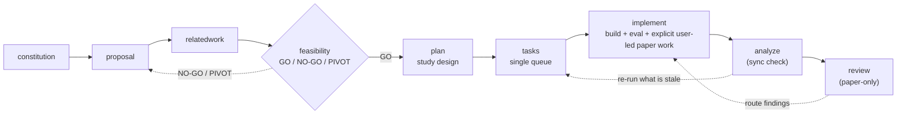

<div align="center">

# 🔬 research-kit

### *Do research in documents, not code.*

**Point it at your manuscript and it reads the whole paper before writing a line. Behind that, a spec-driven pipeline that carries an idea all the way to a draft.**

[](LICENSE)
[](https://github.com/jiancui-research/research-kit/commits/main)
[](#-supported-agents)
[](#-quickstart)
[](https://github.com/jiancui-research/research-kit/stargazers)

[Quickstart](#-quickstart) · [Commands](#-commands) · [Review UI](#review-ui) · [Workflow docs](docs/workflow.md) · [Design](docs/design.md)


</div>

---

## ⚡ Quickstart

**1. Install** — Claude Code:

```text
/plugin marketplace add jiancui-research/research-kit
/plugin install research-kit@research-kit
```

> **On Copilot CLI, use the script below, not its plugin marketplace** — it reports research-kit installed and then exposes no stages at all. Codex CLI works either way: the plugin now ships skills, or use the script for the one-line `/research.x <input>` form.

<details>
<summary>OMP · Codex CLI · Copilot CLI · install script</summary>

**Oh My Pi (OMP)** reads the same bundle:

```text
/marketplace add jiancui-research/research-kit
/marketplace install research-kit@research-kit
```

Update with `/marketplace update research-kit` then `/marketplace upgrade research-kit@research-kit`. From a shell it is `omp plugin marketplace update research-kit && omp plugin upgrade research-kit@research-kit` — marketplace management lives under `omp plugin marketplace`, and refreshing the marketplace alone does **not** bump an installed plugin.

**Codex CLI** — the plugin works (it ships `skills/`), and the script is still worth it:

```text
codex plugin marketplace add https://github.com/jiancui-research/research-kit
codex plugin add research-kit@research-kit
```

Skills are invoked by name (`/skills`, or `$` to mention one) and take their input from what you say next, since Codex skills have no argument substitution. The script instead installs `~/.codex/prompts/`, where `/research.write related-work` works as one line — better while it lasts, but custom prompts are deprecated.

**Copilot CLI — script only:**

```sh
git clone https://github.com/jiancui-research/research-kit && cd research-kit
./install.sh              # Claude Code (default)
./install.sh --codex      # -> ~/.codex/prompts/    (all stages as /research.*)
./install.sh --copilot    # -> ~/.copilot/agents/   (all stages as custom agents)
./install.sh --all        # all three
```

**Their marketplaces report success and give you nothing.** `codex plugin list` shows research-kit `installed, enabled` while delivering **zero** stages — Codex reads a plugin's `skills/`, this bundle carries `commands/`, and skills have no argument substitution anyway. Copilot fails the same silent way. Verify with `ls ~/.codex/prompts/research.*.md` (expect 16) or `ls ~/.copilot/agents/research.*.agent.md`, never the plugin list.

The script targets each agent's documented location: [Codex custom prompts](https://learn.chatgpt.com/docs/custom-prompts) and [Copilot personal custom agents](https://docs.github.com/en/copilot/how-tos/copilot-cli/customize-copilot/create-custom-agents-for-cli).

</details>

**Which agent?** All four run the same stages. For the writing half I draft with Codex CLI, and in my own use it produces the best prose of the four. That is one author's experience rather than a benchmark, so try your own; the pipeline stages behave the same everywhere.

**2. Use it** — in your paper repo:

```sh
/research.init                       # once per repo: puts templates in .research/

# You already have a paper. This is the front door:
/research.write related-work         # reads the WHOLE paper, then works on one section
/research.texreview                  # LaTeX left, PDF right, comment on either

# Starting from an idea instead:
/research.proposal "<your idea>"     # then just follow the "Next:" it prints
```

**Writing works on its own.** `/research.write` reads every section, your tables and captions included, states back what your paper argues, and quotes real sentences of yours to write against — so a new paragraph sounds like the ones around it. No pipeline artifacts required.

**And the pipeline is there when you want it.** Every command ends by naming the next one, so it walks itself; each writes one Markdown doc under `./.research/` that you read and comment on before the next stage builds on it.

Plugin installs namespace the stages: `/research-kit:research.proposal …`.

<details>
<summary><b>Verify the install</b> — an out-of-date copy fails silently by running old stage instructions</summary>

```sh
omp plugin list                   # OMP: expect research-kit@research-kit (<version>)
copilot plugin list               # Copilot CLI: expect research-kit@research-kit (v<version>)
ls ~/.claude/commands/research.*  # script installs (or ~/.codex/prompts/, ~/.copilot/agents/)
```

Compare against `version` in [`.claude-plugin/plugin.json`](.claude-plugin/plugin.json) on `main`. To update:

```sh
omp plugin marketplace update research-kit && omp plugin upgrade research-kit@research-kit
copilot plugin update research-kit
git pull && ./install.sh --all    # script installs; re-running also prunes deleted stages
```

Gotchas seen in practice:

- **`copilot plugin update` fails with `Access is denied. (os error 5)`** when a file is locked by a running CLI. Close other Copilot CLI sessions and retry.
- **A Copilot plugin entry that lists a version can still expose no stages.** `copilot plugin list` reports `research-kit@research-kit (v0.13.0)` while `~/.copilot/agents/` is empty — re-verified on Copilot CLI 1.0.74. Trust `ls ~/.copilot/agents/research.*.agent.md`, not the plugin list.
- **Script installs are per-agent.** Updating the OMP or Claude Code plugin does nothing for `~/.codex/prompts/` or `~/.copilot/agents/`.
- **Windows: `./install.sh` reports `No such file or directory`.** Git checked the script out with CRLF (`core.autocrlf=true`), so the kernel reads the shebang as `#!/usr/bin/env sh\r`. The repo ships a `.gitattributes` pinning `*.sh` to LF; on an older checkout run `git rm --cached install.sh && git checkout HEAD -- install.sh`. The `HEAD` matters — without it `git checkout` looks in the index, where the file was just removed.

</details>

## 🚪 Where you come in

Nobody starts from nothing every time. The pipeline is a chain you can join partway, not a gate you walk through.

<details open>
<summary><b>1. "I already have a LaTeX paper."</b> — writing tool only, no pipeline</summary>

**You do not need the pipeline to use the writing half.** The section commands read the manuscript itself, so a paper with no `proposal.md` behind it still works — the argument gets derived from your abstract and contribution list instead.

```sh
/research.init                       # just puts the templates and craft guides in place
/research.style                      # optional: point it at papers you want to sound like
/research.write related-work         # reads the WHOLE paper, states its argument, then works
/research.texreview                  # comment on the PDF; the agent picks the comments up
/research.review                     # mock reviewer panel, reading only the paper
```
</details>

<details>
<summary><b>2. "I have an idea and nothing else."</b> — the full chain</summary>

```sh
/research.init && /research.constitution
/research.proposal "<your raw idea, however rough>"
/research.relatedwork          # sharpens the gap back into proposal.md
/research.feasibility          # GO / NO-GO / PIVOT — the cheapest stage to fail at
/research.plan && /research.tasks
/research.implement            # build + eval, until the queue is done
```
</details>

<details>
<summary><b>3. "I have code and results, but no paper."</b> — start at the argument, skip the gate</summary>

The riskiest question is already answered, so `feasibility` has nothing to add. What you are missing is the argument the results support, and the ledger tying one to the other.

```sh
/research.init
/research.proposal "<what the results show, and why it matters>"
/research.plan                 # describe what you built, not what you planned to
/research.tasks                # the queue comes out as mostly Eval + Paper
/research.implement            # fills claims.md: every claim -> supported / partial / refuted
/research.analyze              # names where code, evidence, and docs disagree
```

`claims.md` is what makes this path worth it: it stops a number in the abstract from drifting away from the experiment that produced it.
</details>

<details>
<summary><b>4. "I have rough notes or an old draft."</b> — feed them to the entry stage</summary>

`proposal` takes prose as input, not just a one-liner.

```sh
/research.init
/research.proposal "$(cat notes.md)"     # or just say where the notes live
/research.mdreview                       # read it, comment in place, let the agent revise
```

From there, join path 1 or 2 depending on whether the work exists yet.
</details>

## 🤔 Why

1. **Write in your paper's voice, not an agent's.** `/research.write` reads the whole manuscript before touching a section — every table, every caption — then quotes real sentences of yours to write against, because a list of style rules is easy to satisfy while still writing in your own register. Underneath sit craft guides per section and per paper type, and `/research.style` learns what you tell it and what your edits reveal.
2. **Think on the page.** Comment on your docs and your compiled PDF in place; the agent reads the comments straight out of the repo and acts on them. No copy-paste round trip. `/research.review` then reads **only** the paper — the way a committee does — using your venue's own reviewer guidelines.
3. **A pipeline when the work needs one.** Every stage ends in one Markdown doc you review; code and eval scripts are the agent's job. Two guardrails keep it honest: `feasibility` returns **GO / NO-GO / PIVOT** before you over-invest, and `analyze` names exactly what drifted and what to re-run.

<a id="review-ui"></a>

## 🖥️ The two review UIs

Handing the build to an agent only works if you can *see* what it did. Both are local web UIs, one Python file each, localhost only, nothing beyond `uv` to install.

### 📄 The paper: `/research.texreview`

**A single-user local Overleaf with the review loop built in.** LaTeX source left, compiled PDF right, and comments that know which line of which `.tex` file they belong to.


Select text in the PDF *or* the source and a **Comment** button appears — or press `⌘⇧M`, or right-click. Every comment records the quote plus a `file.tex:line` target — so *"read `.texreview/comments.json` and address the open comments"* just works. `⌘S` recompiles. Click any rendered word to jump to its source.

<details>
<summary>SyncTeX fallbacks, editor shortcuts, export</summary>

- 🎯 **Click-to-source, even when SyncTeX can't help.** When it only points at a structural line (`acmart` typesets `\begin{abstract}` during `\maketitle`; the `comment` package routes blocks through a generated file), texreview falls back to searching the sources for the words you clicked. **Reveal →** goes the other way, flashing the PDF box for your cursor line.
- 🔨 **Recompile on save.** `⌘S` runs `latexmk -pdf -synctex=1` and reloads the pane; saves landing mid-compile queue one follow-up instead of stacking. Errors show a parsed log. Compile in a terminal instead and the pane still refreshes.
- ⌨️ **Editor basics that matter in LaTeX** — `⌘B`/`⌘I` wrap the selection in `\textbf{}`/`\textit{}` (press again to unwrap), find in file (`⌘F`) with a live match count, comment toggle (`⌘/`), syntax colour with line numbers, bracket matching that tints the partner of whichever `{` or `[` your cursor sits on (and reddens one with no partner, which is a compile error waiting to happen), collapsible folders so a 25-file paper repo opens at six rows.
- 📋 **Export with targets** — open comments copy to the clipboard with ids, `file:line` targets, and reply instructions, for any AI outside the repo.
- ✅ **Resolution round-trip.** The agent replies with what it changed and marks comments resolved; the fix is highlighted on the next compile.

Launch from the manuscript repo or the research repo (it follows `.research/paper-repo`): `/research.texreview`, or `uv run tools/texreview.py --open`. Needs `uv` plus a TeX install.

</details>

### 📝 The documents: `/research.mdreview`


Click any paragraph, list item, table row or code block in the **rendered** view and it becomes just that markdown; click away and it renders again. Only the lines you touched are rewritten. Select text to comment; comments live as sidecar JSON in `./.mdreview/`, so your markdown stays clean and any agent can read them.

<details>
<summary>Layouts, mermaid, safe saves</summary>

- 🔀 **Two layouts, one tool** — the default is one wide pane you edit in; `/research.mdreview split` puts raw source beside the rendered preview with click-to-source sync. Same server, same comments.
- ✍️ **Why editing is safe** — the source range comes from the markdown parser rather than from converting HTML back to markdown, so tables, spacing, and raw HTML elsewhere are never reflowed.
- 🧜 **Mermaid diagrams** — ` ```mermaid ` fences render with a zoom + pan lightbox (via CDN; they fall back to code blocks offline).
- 🔒 **Safe saves** — atomic writes with a conflict guard for when the file changed on disk mid-review, plus a `.research/ only` sidebar filter.

| Comment on a selection | Click-to-source sync + mermaid |
| --- | --- |
|  |  |

Launch from any repo: `/research.mdreview`, or `uv run tools/mdreview.py --open` (add `--split`).

</details>

## 🧩 Commands

| Command | What it does |
| --- | --- |
| `/research.init` | Copy the bundled templates into this paper repo's `.research/templates/` (run once per repo). |
| `/research.constitution` | Establish or update the research constitution: quality principles, writing voice, venue norms. |
| `/research.proposal` | Pipeline entry: turn a raw idea into a readable 1-3 page argument (falsifiable thesis, argued gap, pre-committed validation plan, venue and paper type). |
| `/research.relatedwork` | Survey prior work into `related-work.md` and sharpen the proposal's gap and positioning. |
| `/research.feasibility` | De-risk the central result with a quick probe and return a GO / NO-GO / PIVOT verdict. |
| `/research.plan` | The study's technical design into `plan.md`: architecture, evaluation design, key decisions, layout. Stable; tasks derive from it. |
| `/research.tasks` | Derive the single work queue `tasks.md` from the plan; re-runs refine, preserving checkbox states. |
| `/research.implement` | Execute the whole queue: build code, run evals, maintain claims, and handle `[USER-LED]` manuscript tasks only when explicitly selected. |
| `/research.write` | Write or revise one manuscript section: reads the whole paper and states its argument before any prose, then outlines, revises, critiques, or drafts. |
| `/research.style` | Optional: build `.research/writing/style.md`, the file the writing commands read for how *you* want your paper written — from papers you admire, instructions you give, and edits you make. |
| `/research.analyze` | Read-only cross-artifact audit **and** sync checker across plan, tasks, code, evidence, and manuscript: flags drift and names the exact re-run. |
| `/research.review` | Simulate a reviewer panel reading **only the paper**: mock reviews + scores, plus a suggested fix command per finding. |
| `/research.rebuttal` | Draft a prioritized, evidence-backed rebuttal to reviewer comments, fitted to the venue word limit. |
| `/research.ae` | Prepare an artifact-evaluation submission: reproducibility checklist, artifact README, badge plan, archival link. |
| `/research.mdreview` | Local web UI for the repo's markdown: revise directly in the rendered view, comment, export (needs `uv`). Add `split` for source beside preview. |
| `/research.texreview` | Review the compiled paper: LaTeX left, PDF right, SyncTeX sync, comments carrying `file:line`, recompile on save (needs `uv` + TeX). |

## 🗺️ The pipeline


```mermaid
flowchart LR
    C[constitution] --> P[proposal] --> RW[relatedwork] --> F{feasibility<br/>GO / NO-GO / PIVOT}
    F -.->|NO-GO / PIVOT| P
    F -->|GO| PL["plan<br/>study design"]
    PL --> T["tasks<br/>single queue"]
    T --> I["implement<br/>build + eval + explicit user-led paper work"]
    I --> A["analyze<br/>(sync check)"] --> R["review<br/>(paper-only)"]
    A -.->|re-run what is stale| T
    R -.->|route findings| I
```

After feasibility's GO, `plan` fixes the stable study design and `tasks` derives one queue. `implement` owns that queue — it builds, runs evals, updates `claims.md`, and touches manuscript tasks only when you explicitly select them. `rebuttal` and `ae` are auxiliary.

📐 **[Per-command inputs and outputs →](docs/workflow.md)**

## 🤖 Supported agents

| Agent | Install | How you invoke a stage |
| --- | --- | --- |
| **Claude Code** (plugin) | `/plugin install research-kit@research-kit` | `/research-kit:research.proposal <text>` |
| **Oh My Pi (OMP)** (plugin) | `/marketplace install research-kit@research-kit` | `/research-kit:research.proposal <text>` |
| **Claude Code** (script) | `./install.sh` | `/research.proposal <text>` |
| **Codex CLI** (script only) | `./install.sh --codex` | `/research.proposal <text>` |
| **GitHub Copilot CLI** (script only) | `./install.sh --copilot` | `/agent` → pick `research.proposal` |

<details>
<summary><b>Why Codex and Copilot need the script; self-pruning and overrides</b></summary>

- **OMP** installs the same `.claude-plugin` bundle, reading `commands/` directly (it falls back to `.claude-plugin/marketplace.json` when `.omp-plugin/` is absent). Plugin commands resolve bundled templates and tools through `~/.omp/plugins/installed_plugins.json`.
- **Codex** reads a plugin's `skills/` directory, and until v0.38.0 this bundle shipped only `commands/` — so `codex plugin list` reported it `installed, enabled` while exposing **zero** stages (verified on Codex CLI 0.149.1; even argument-free `research.init`, which survived at 0.145.0, no longer appeared). It now ships `.codex-plugin/plugin.json` + `skills/<name>/SKILL.md` as well. Each skill is a **pointer**, not a copy: it carries the frontmatter Codex needs for discovery and then tells the agent to read `commands/<stage>.md` from the same plugin, so the instructions still have one home and cannot drift. Skills have no argument substitution — frontmatter is `name` + `description` only — so a stage takes its input from what you say when you invoke it. For the one-line `/research.write related-work` form, `./install.sh --codex` still installs `~/.codex/prompts/`, where `$ARGUMENTS`, `$1`–`$9`, and named `KEY=value` all work; those are deprecated in favour of skills with no announced removal date, which is why the plugin path now exists.
- **Copilot** expects `plugin.json` at the repo root plus an `agents/` or `skills/` directory; it no longer surfaces a plugin's `commands/`. This worked at Copilot CLI 1.0.40 and stopped by 1.0.63. The failure is quiet: install succeeds, `plugin list` prints a version, the bundle really is unpacked under `~/.copilot/installed-plugins/` — but the stages never appear.
- **One install for all four** would require shipping stages as `skills/<name>/SKILL.md`, the one format every agent reads. The trade-off is that skills are model-invocable, so stages could fire without you asking; `docs/design.md` records the analysis.
- **Self-pruning & overrides.** Re-running `install.sh` removes commands deleted from the bundle. Override destinations with `CLAUDE_COMMANDS_DIR` / `CODEX_PROMPTS_DIR` / `COPILOT_AGENTS_DIR` (or `CODEX_HOME`); `--symlink` links instead of copies; `--uninstall` removes everything.

</details>

## 📁 Working directory

Tracking docs live under `./.research/` — commit it alongside the paper as the decision record. Work products (code, data, paper source) live in sibling root folders.

<details>
<summary><b>Full layout</b></summary>

```
<project>/                 one repo under ~/Projects
  .research/               all research-kit tracking docs:
    memory/constitution.md   research principles + writing voice
    templates/               skeletons + craft guides (from /research.init)
    writing/                 optional: samples/ you chose + style.md (register, your standing
                             instructions, what your edits taught it)
    proposal.md              problem, NABC, gap, contributions, RQs, venue, paper type
    related-work.md          prior work + positioning
    feasibility.md           de-risk probe + GO / NO-GO / PIVOT
    plan.md                  study design: architecture + eval design + layout (stable)
    tasks.md                 the single work queue: Setup/Build/Eval/Paper/Polish (churns)
    claims.md                claim ↔ evidence matrix (the shared sync point)
    analyze-report.md        prioritized gap + sync report
    review/ rebuttal/ ae/    outputs of those commands
  feasibility/             throwaway probe code
  src/                     the system code (folder declared in plan.md)
  eval/                    eval writeups + index + scripts, data, results
  paper/                   manuscript source — or a dedicated sibling repo
                           <name>-<venue><yy>-latex recorded in .research/paper-repo
```

</details>

## 🎨 Customization

`.research/memory/constitution.md` sets the quality bar, writing voice, and venue norms every command reads first. Commands are paper-type aware (measurement, attack, defense, benchmark, SoK); skeletons and craft guides live in `templates/`. `/research.style` is the optional layer on top.

## 🤝 Contributing

See [CONTRIBUTING.md](CONTRIBUTING.md). Keep it simple, keep the pipeline consistent, and write original, generalizable guidance.

## 🙏 Credits & license

Inspired by [GitHub spec-kit](https://github.com/github/spec-kit) (MIT), which brought Spec-Driven Development to software. MIT licensed — see [LICENSE](LICENSE).
