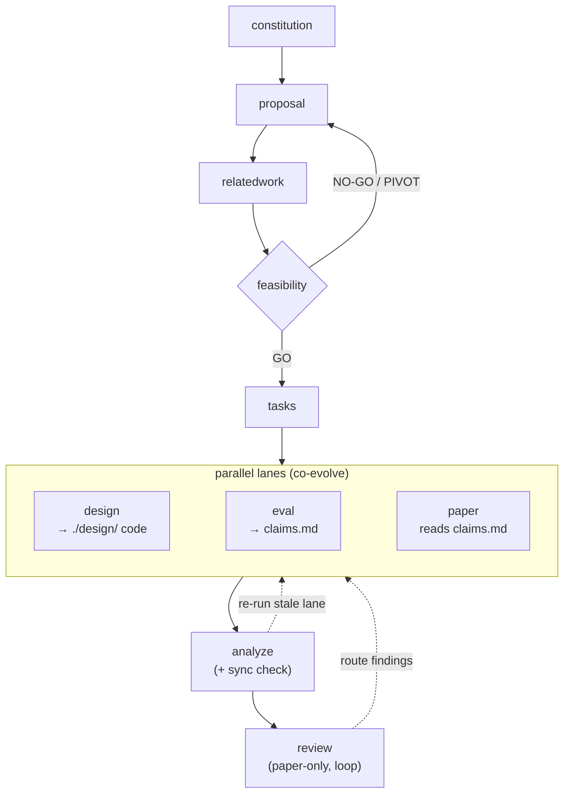

# research-kit workflow

The pipeline and the input/output of every command. (See the [README](../README.md) for install + quickstart.)

## Diagram



**Reading it**

- **Solid arrows** = the pipeline; **dashed** = the two feedback loops.
- `feasibility` is a GO / NO-GO / PIVOT gate; a NO-GO or PIVOT loops back to `proposal`.
- After a GO, `tasks` opens three parallel lanes that co-evolve: `design` builds the system into `./design/`, `eval` fills `claims.md`, `paper` reads `claims.md` to write.
- Lanes never write into each other - they share only the docs they read (`tasks/design.md`, `claims.md`).
- `analyze` = the sync checker: detects lane drift, routes the exact re-run, and doubles as the review-readiness audit.
- `review` reads only the paper (like a real reviewer); it reports findings + scores and suggests a fix command per finding — you route them and re-run, looping until clean.
- `design` is paper-type aware: heavy for systems / defense, skipped for measurement / SoK.
- Auxiliary: `rebuttal` (post-submission), `ae` (artifact evaluation), `mdreview` (optional local review UI; its `./.mdreview/` comment sidecars are plain JSON any lane's command can read - it writes no pipeline artifact).

## Input → output, per command

All research-kit **tracking docs** live under `./.research/`; the actual **work products** (code, data, paper source) live in sibling root folders — `feasibility/`, `design/`, `eval/`, `paper/`. The whole project is one repo under `~/Projects`, outside the vault. Exception: the manuscript may live in a **dedicated sibling repo** (`<shortname>-<venue><yy>-latex`, e.g. `codary-sp27-latex`) resolved by `/research.paper` and recorded in `.research/paper-repo`; paper-stage commands read that pointer and fall back to `./paper/`.

| Command | Reads (input) | Writes (new) | Updates (existing) |
| --- | --- | --- | --- |
| `constitution` | your focus areas | `memory/constitution.md` | itself on re-run |
| `proposal` | your raw idea | `proposal.md` | itself on re-run |
| `relatedwork` | `proposal.md` | `related-work.md` | **`proposal.md`** (sharpens gap/positioning) |
| `feasibility` | `proposal.md` (+ `related-work.md`) | `feasibility.md` | — |
| `tasks` | `proposal.md` + `feasibility.md` | `tasks/design.md`, `tasks/eval.md`, `tasks/paper.md` | — |
| `design` (build) | `tasks/design.md` | **code in `./design/`** | `tasks/design.md` (build status) |
| `eval` | `tasks/eval.md` | `eval/NN-*.md`, `eval/index.md` | **`claims.md`** |
| `paper` (human-led) | `tasks/paper.md`, `tasks/design.md`, `proposal`, `related-work`, `claims.md` | `<manuscript>/<section>.md` | `tasks/paper.md` (status), `paper-repo` pointer |
| `analyze` (+ sync) | everything (read-only) | `analyze-report.md` | — (routes re-runs) |
| `review` (loop) | `paper` only (+ constitution) | `review/round-N.md` | — (suggests a fix command per finding; you route) |
| `rebuttal` (aux) | reviewer comments | `rebuttal/rebuttal.md` | — |
| `ae` (aux) | `claims`, `tasks`, `eval/` | `ae/*` | — |

### Write-edges, and how the three lanes talk

Only **two** commands ever **write into another command's document** — the feedback that makes this a workflow rather than a one-way chain:

1. **`relatedwork` → `proposal.md`** — the survey sharpens the gap and positioning.
2. **`eval` → `claims.md`** — results fill the claim ↔ evidence matrix.

(`review` is report-only: it reads just the paper and writes only `review/round-N.md`, suggesting a fix command per finding that *you* run — it never writes into another lane. `analyze` is likewise read-only, routing re-runs without editing.)

The three lanes (`design ∥ eval ∥ paper`) stay decoupled because they communicate **only through shared documents they read, never write into each other**:

- `design` writes its **code** (own repo) and `tasks/design.md` (own status); `eval` and `paper` *read* `tasks/design.md` (the system spec, and the source for the System Design section).
- `eval` writes `claims.md`; `paper` *reads* it and tags any unbacked claim `[UNVERIFIED]`.
- `analyze` is read-only: when a lane drifts, it does not edit the others — it **routes the re-run** (`design changed → re-run eval NN + paper system-design`) so each owning command re-syncs its own artifact. That is the sync mechanism: detect with `analyze`, reflect by re-running the owner.

## Task surfaces

The actual *doing* lives in four separate places, each scoped to its job — don't confuse them:

| task surface | where | scope | feeds |
| --- | --- | --- | --- |
| **feasibility probe** | `feasibility.md` (Probe plan) | throwaway de-risk | the GO/NO-GO verdict |
| **design / build tasks** | `tasks/design.md` | build the system (→ code) | `/research.design` → `./design/` + System Design section |
| **eval tasks** | `tasks/eval.md` | rigorous evaluation | `claims.md` → the paper |
| **paper tasks** | `tasks/paper.md` | writing | the draft |

The feasibility probe keeps its own short checklist inside `feasibility.md` and deliberately does **not** enter `claims.md`. The design lane is paper-type aware: present for build-papers (systems / defense / attack / benchmark), skipped for measurement / SoK (any light data-obtain stays in `tasks/eval.md`).

## Examples

Measurement paper (no design lane):

```text
/research.proposal     LLM agents leak secrets via tool-call arguments; measure how often
/research.relatedwork  group by attack vs defense; closest baseline is GuardAgent
/research.feasibility  just find 5 real leak instances by hand first
/research.tasks
/research.eval   run the baseline comparison
/research.paper intro            # outline (default; you write the prose)
/research.paper draft eval       # full prose (opt-in)
/research.analyze
/research.review evaluation      # one lens, or omit for the full panel
```

Systems / defense paper (the design lane builds the system):

```text
/research.tasks
/research.design                 # implement the architecture into ./design/
/research.eval             # evaluate the built system, fill claims.md
/research.paper system-design    # outline the section from tasks/design.md
/research.analyze sync           # after a design change: what's stale + what to re-run
```
