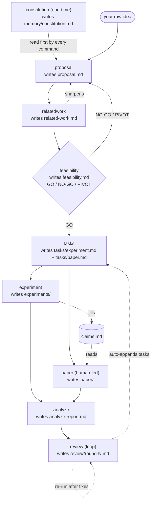

# research-kit workflow

The pipeline and the input/output of every command. (See the [README](../README.md) for install + quickstart.)

## Diagram



**Reading it:** solid arrows are the pipeline flow; dashed arrows are cross-document updates, reads, and loops. `feasibility` is a GO/NO-GO/PIVOT gate (a NO-GO or PIVOT loops back to `proposal`). `experiment` and `paper` run **in parallel**, synced by `claims.md`. `review` is a **loop** — re-run after fixes until no high-severity findings remain. Auxiliary commands `rebuttal` (post-submission) and `ae` (artifact evaluation) run as needed.

## Input → output, per command

All artifacts live under `./.research/` in your paper repo.

| Command | Reads (input) | Writes (new) | Updates (existing) |
| --- | --- | --- | --- |
| `constitution` | your focus areas | `memory/constitution.md` | itself on re-run |
| `proposal` | your raw idea | `proposal.md` | itself on re-run |
| `relatedwork` | `proposal.md` | `related-work.md` | **`proposal.md`** (sharpens gap/positioning) |
| `feasibility` | `proposal.md` (+ `related-work.md`) | `feasibility.md` | — |
| `tasks` | `proposal.md` + `feasibility.md` | `tasks/experiment.md`, `tasks/paper.md` | — |
| `experiment` | `tasks/experiment.md` | `experiments/NN-*.md`, `experiments/index.md` | **`claims.md`** |
| `paper` (human-led) | `tasks/paper.md`, `proposal`, `related-work`, `claims.md` | `paper/<section>.md` | `tasks/paper.md` (status) |
| `analyze` | everything (read-only) | `analyze-report.md` | — |
| `review` (loop) | `proposal`, `related-work`, `claims`, `paper` | `review/round-N.md` | **`tasks/experiment.md`** (auto-appends) |
| `rebuttal` (aux) | reviewer comments | `rebuttal/rebuttal.md` | — |
| `ae` (aux) | `claims`, `tasks`, `experiments` | `ae/*` | — |

### The three cross-document edges

Only three commands ever touch another command's document — the feedback that makes this a workflow rather than a one-way chain:

1. **`relatedwork` → `proposal.md`** — the survey sharpens the gap and positioning.
2. **`experiment` → `claims.md`** — results fill the claim ↔ evidence matrix.
3. **`review` → `tasks/experiment.md`** — evidence-gap findings become new experiment tasks.

Everything else writes only its own artifact. `paper` and `experiment` stay decoupled because they communicate **only** through `claims.md`: `experiment` writes verdicts, `paper` reads them and tags any unbacked claim `[UNVERIFIED]`.

## Three task surfaces

The actual *doing* lives in three separate places, each scoped to its job — don't confuse them:

| task surface | where | scope | feeds |
| --- | --- | --- | --- |
| **feasibility probe** | `feasibility.md` (Probe plan) | throwaway de-risk | the GO/NO-GO verdict |
| **experiment tasks** | `tasks/experiment.md` | rigorous, repeatable | `claims.md` → the paper |
| **paper tasks** | `tasks/paper.md` | writing | the draft |

The feasibility probe keeps its own short checklist inside `feasibility.md` and deliberately does **not** enter `claims.md` — its results decide whether to proceed, not what the paper claims. After a GO, `tasks` formalizes anything worth keeping into a real experiment task.

## Examples

```text
/research.proposal     LLM agents leak secrets via tool-call arguments; measure how often
/research.relatedwork  group by attack vs defense; closest baseline is GuardAgent
/research.feasibility  just find 5 real leak instances by hand first
/research.tasks
/research.experiment   run the baseline comparison
/research.paper intro            # outline (default; you write the prose)
/research.paper draft eval       # full prose (opt-in)
/research.analyze
/research.review evaluation      # one lens, or omit for the full panel
```
