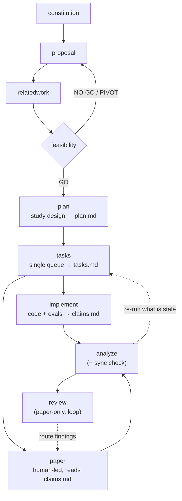

# research-kit workflow

The pipeline and the input/output of every command. (See the [README](../README.md) for install + quickstart.)

## Diagram



**Reading it**

- **Solid arrows** = the pipeline; **dashed** = the feedback loops.
- `feasibility` is a GO / NO-GO / PIVOT gate; a NO-GO or PIVOT loops back to `proposal`.
- After a GO, `plan` fixes the **study design** (`plan.md` - architecture, evaluation design, decisions, layout; stable) and `tasks` derives the **work queue** (`tasks.md` - single file, Setup/Build/Eval/Paper/Polish sections; expected to churn).
- `implement` works the queue: Build tasks produce code in the folder `plan.md` declares (default `src/`, legacy `design/`); Eval tasks run and fill `claims.md`. It **never executes Paper tasks** - those are tagged `[HUMAN]` and belong to `/research.paper`, which runs in parallel reading `claims.md`.
- `analyze` = the sync checker: detects drift among plan, tasks, code, evidence, and manuscript, routes the exact re-run, and doubles as the review-readiness audit.
- `review` reads only the paper (like a real reviewer); it reports findings + scores and suggests a fix command per finding — you route them and re-run, looping until clean.
- The Build section is paper-type aware: heavy for systems / defense, medium for attack / benchmark, minimal or absent for measurement / SoK.
- Auxiliary: `rebuttal` (post-submission), `ae` (artifact evaluation), `mdreview` (optional local review UI; its `./.mdreview/` comment sidecars are plain JSON any command can read - it writes no pipeline artifact).

## Input → output, per command

All research-kit **tracking docs** live under `./.research/`; the actual **work products** (code, data, paper source) live in sibling root folders — `feasibility/`, the code folder `plan.md` declares (default `src/`, legacy `design/`), `eval/`, `paper/`. The whole project is one repo under `~/Projects`, outside the vault. Exception: the manuscript may live in a **dedicated sibling repo** (`<shortname>-<venue><yy>-latex`, e.g. `codary-sp27-latex`) resolved by `/research.paper` and recorded in `.research/paper-repo`; paper-stage commands read that pointer and fall back to `./paper/`.

| Command | Reads (input) | Writes (new) | Updates (existing) |
| --- | --- | --- | --- |
| `constitution` | your focus areas | `memory/constitution.md` | itself on re-run |
| `proposal` | your raw idea | `proposal.md` | itself on re-run |
| `relatedwork` | `proposal.md` | `related-work.md` | **`proposal.md`** (sharpens gap/positioning) |
| `feasibility` | `proposal.md` (+ `related-work.md`) | `feasibility.md` | — |
| `plan` | `proposal.md` + `feasibility.md` (+ `related-work.md`) | `plan.md` | itself on re-run |
| `tasks` | `plan.md` + `proposal.md` | `tasks.md` | itself on re-run (refine; states preserved) |
| `implement` | `plan.md` + `tasks.md` | **code** (declared folder), `eval/NN-*.md`, `eval/index.md` | **`claims.md`**, `tasks.md` (checkboxes), `plan.md` (built-reality deviations, flagged) |
| `paper` (human-led) | `tasks.md` (Paper section), `plan.md`, `proposal`, `related-work`, `claims.md` | `<manuscript>/<section>.md` | `tasks.md` (Paper status), `paper-repo` pointer |
| `analyze` (+ sync) | everything (read-only) | `analyze-report.md` | — (routes re-runs) |
| `review` (loop) | manuscript only (+ constitution) | `review/round-N.md` | — (suggests a fix command per finding; you route) |
| `rebuttal` (aux) | reviewer comments | `rebuttal/rebuttal.md` | — |
| `ae` (aux) | `claims`, `plan.md`, `eval/` | `ae/*` | — |

### Write-edges, and how implement and paper talk

Only **two** commands ever **write into another command's document** — the feedback that makes this a workflow rather than a one-way chain:

1. **`relatedwork` → `proposal.md`** — the survey sharpens the gap and positioning.
2. **`implement` → `claims.md`** — Eval-task results fill the claim ↔ evidence matrix.

(`review` is report-only: it reads just the paper and writes only `review/round-N.md`, suggesting a fix command per finding that *you* run. `analyze` is likewise read-only, routing re-runs without editing. `implement` ticking checkboxes in `tasks.md` and recording built-reality deviations in `plan.md` is status-keeping on its own inputs, not a cross-write.)

`implement` and `paper` stay decoupled because they communicate **only through shared documents they read, never write into each other**:

- `implement` writes code and `claims.md`; `paper` *reads* `plan.md` (System Design source) and `claims.md`, tagging any unbacked claim `[UNVERIFIED]`.
- `paper` never enters the queue: its tasks are `[HUMAN]`-tagged in `tasks.md` and `implement` skips them.
- `analyze` is read-only: when something drifts, it does not edit the stale artifact — it **routes the re-run** (`plan changed → re-run tasks (refine), then implement T021 + paper system-design`) so each owning command re-syncs its own artifact.

## Task surfaces

The actual *doing* lives in three separate places, each scoped to its job — don't confuse them:

| task surface | where | scope | feeds |
| --- | --- | --- | --- |
| **feasibility probe** | `feasibility.md` (Probe plan) | throwaway de-risk | the GO/NO-GO verdict |
| **the work queue** | `tasks.md` (Setup/Build/Eval/Polish) | build + rigorous evaluation | code, `eval/`, `claims.md` |
| **paper tasks** | `tasks.md` (Paper section, `[HUMAN]`) | writing | the manuscript |

The feasibility probe keeps its own short checklist inside `feasibility.md` and deliberately does **not** enter `claims.md`. The plan (`plan.md`) holds no tasks at all — it is the stable design the queue derives from.

## Examples

Measurement paper (minimal Build section):

```text
/research.proposal     LLM agents leak secrets via tool-call arguments; measure how often
/research.relatedwork  group by attack vs defense; closest baseline is GuardAgent
/research.feasibility  just find 5 real leak instances by hand first
/research.plan
/research.tasks
/research.implement              # collection pipeline + baseline comparison, fill claims.md
/research.paper intro            # outline (default; you write the prose)
/research.paper draft eval       # full prose (opt-in)
/research.analyze
/research.review evaluation      # one lens, or omit for the full panel
```

Systems / defense paper (heavy Build section):

```text
/research.plan                   # architecture + eval design + code folder declaration
/research.tasks
/research.implement              # build into ./src/, run evals, fill claims.md
/research.paper system-design    # outline the section from plan.md
/research.analyze sync           # after a plan change: what's stale + what to re-run
```
