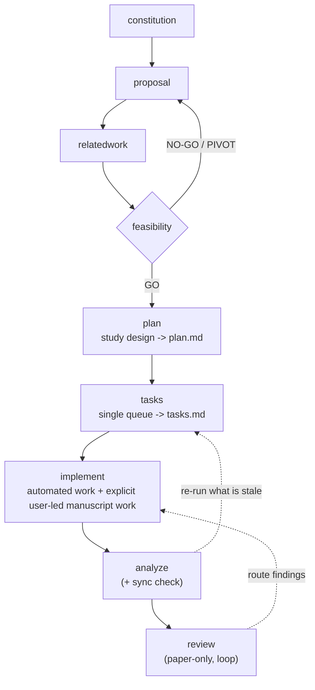

# research-kit workflow

The pipeline and the input/output of every command. (See the [README](../README.md) for install + quickstart.)

## Diagram


```mermaid
flowchart TD
    C[constitution] --> P[proposal] --> RW[relatedwork] --> F{feasibility}
    F -->|"NO-GO / PIVOT"| P
    F -->|GO| PL["plan<br/>study design -> plan.md"]
    PL --> T["tasks<br/>single queue -> tasks.md"]
    T --> I["implement<br/>automated work + explicit user-led manuscript work"]
    I --> AN["analyze<br/>(+ sync check)"]
    AN -.->|"re-run what is stale"| T
    AN --> RV["review<br/>(paper-only, loop)"]
    RV -.->|"route findings"| I
```

**Reading it**

- **Solid arrows** = the pipeline; **dashed** = the feedback loops.
- `feasibility` is a GO / NO-GO / PIVOT gate; a NO-GO or PIVOT loops back to `proposal`.
- After a GO, `plan` fixes the stable study design and `tasks` derives one Setup/Build/Eval/Paper/Polish queue.
- `implement` owns every queue section. Empty/default runs work automated Setup/Build/Eval/Polish tasks and skip `[USER-LED]` Paper tasks. Manuscript work runs only after explicit task-id or `paper`/`outline`/`critique`/`draft` input.
- `analyze` detects drift among plan, tasks, code, evidence, and manuscript and routes the exact re-run.
- `review` reads only the manuscript and routes findings back to explicit implement modes.
- Build remains paper-type aware; auxiliaries are `write` (one manuscript section, outside the queue), `rebuttal`, `ae`, and the optional review UIs `mdreview` / `mdsplit` (markdown) and `texreview` (LaTeX + PDF).

## Input → output, per command

All tracking docs live under `./.research/`; code, data, evaluation outputs, and manuscript source live outside it. A dedicated sibling manuscript repo (`<shortname>-<venue><yy>-latex`) is resolved by explicit `/research.implement paper <section>` mode and recorded in `.research/paper-repo`; manuscript readers use that pointer and fall back to `./paper/`.

| Command | Reads (input) | Writes (new) | Updates (existing) |
| --- | --- | --- | --- |
| `constitution` | your focus areas | `memory/constitution.md` | itself on re-run |
| `proposal` | your raw idea | `proposal.md` | itself on re-run |
| `relatedwork` | `proposal.md` | `related-work.md` | **`proposal.md`** (sharpens gap/positioning) |
| `feasibility` | `proposal.md` (+ `related-work.md`) | `feasibility.md` | — |
| `plan` | `proposal.md` + `feasibility.md` (+ `related-work.md`) | `plan.md` | itself on re-run |
| `tasks` | `plan.md` + `proposal.md` | `tasks.md` | itself on re-run (refine; states preserved) |
| `implement` | `plan.md` + `tasks.md`; Manuscript mode also reads proposal, related work, claims, and skeleton | code, `eval/NN-*.md`, `eval/index.md`, `<manuscript>/<section>.md` | `claims.md`, `tasks.md`, `plan.md` deviations, `paper-repo` pointer |
| `write` (aux) | manuscript + section craft guides (+ `.research/` artifacts when present) | `<manuscript>/<section>.md` or `.outline.md`/`.critique.md` | — (does not touch `tasks.md`) |
| `analyze` (+ sync) | everything (read-only) | `analyze-report.md` | — (routes re-runs) |
| `review` (loop) | manuscript only (+ constitution) | `review/round-N.md` | — (suggests a fix command per finding; you route) |
| `rebuttal` (aux) | reviewer comments | `rebuttal/rebuttal.md` | — |
| `ae` (aux) | `claims`, `plan.md`, `eval/` | `ae/*` | — |

### Write-edges and explicit Manuscript mode

Only two semantic cross-writes make the pipeline a feedback loop:

1. **`relatedwork` -> `proposal.md`:** the survey sharpens gap and positioning.
2. **`implement` -> `claims.md`:** Eval-task results fill the claim-to-evidence matrix.

`review` and `analyze` remain report-only. `implement` also performs status-keeping on its own inputs (`tasks.md`, and built-reality deviations in `plan.md`). In explicit Manuscript mode it reads `plan.md` and `claims.md`, writes only manuscript work plus the selected task status, and labels unsupported result beats `[UNVERIFIED]`. Default execution cannot select `[USER-LED]` tasks, so fusing the command does not make manuscript drafting automatic.

## Task surfaces

The actual doing has two task surfaces:

| task surface | where | scope | feeds |
| --- | --- | --- | --- |
| **feasibility probe** | `feasibility.md` (Probe plan) | throwaway de-risk | GO/NO-GO/PIVOT |
| **single work queue** | `tasks.md` (Setup/Build/Eval/Paper/Polish) | automated work plus explicitly selected `[USER-LED]` manuscript work | code, eval, claims, manuscript |

The feasibility probe stays outside `claims.md`. `plan.md` has no tasks; `tasks.md` is the only full-study queue.

## Examples

Measurement paper (minimal Build section):

```text
/research.proposal     LLM agents leak secrets via tool-call arguments; measure how often
/research.relatedwork  group by attack vs defense; closest baseline is GuardAgent
/research.feasibility  just find 5 real leak instances by hand first
/research.plan
/research.tasks
/research.implement              # collection pipeline + baseline comparison, fill claims.md
/research.implement paper intro  # explicit outline; user writes the prose
/research.implement draft eval   # full prose, explicit opt-in
/research.analyze
/research.review evaluation      # one lens, or omit for the full panel
```

Systems / defense paper (heavy Build section):

```text
/research.plan                   # architecture + eval design + code folder declaration
/research.tasks
/research.implement                      # build into ./src/, run evals, fill claims.md
/research.implement paper system-design  # explicit outline sourced from plan.md
/research.analyze sync           # after a plan change: what's stale + what to re-run
```
