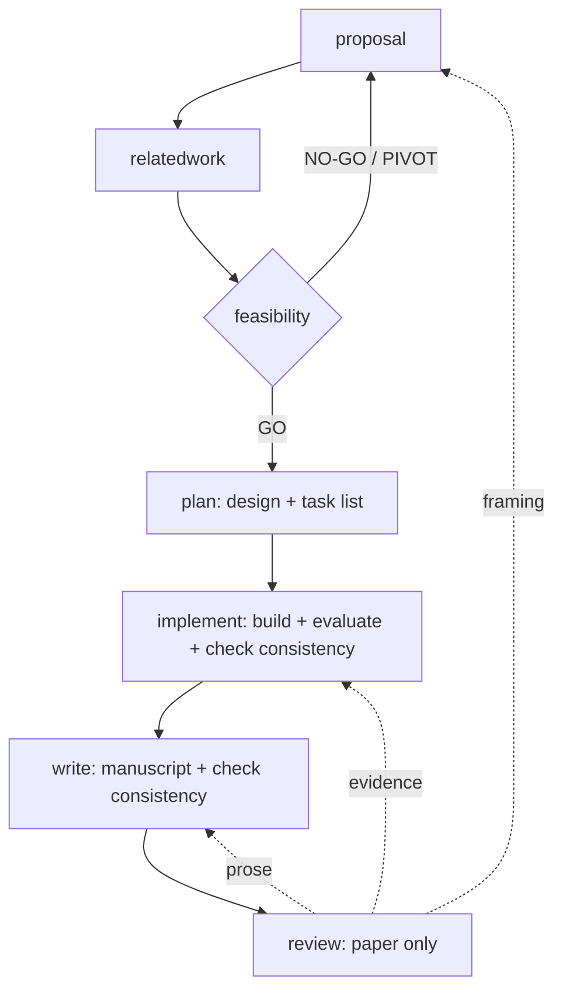

# Research-kit workflow

Nine public commands cover the research loop, writing, and two independent viewers.
See the [README](../README.md) for a quick start and [installation](install.md) for upgrades.

## Research loop


```mermaid
flowchart TD
    P[proposal] --> RW[relatedwork] --> F{feasibility}
    F -->|NO-GO / PIVOT| P
    F -->|GO| PL["plan: design + task list"]
    PL --> I["implement: build + evaluate + check consistency"]
    I --> W["write: manuscript + check consistency"]
    W --> R["review: paper only"]
    R -.->|framing| P
    R -.->|evidence| I
    R -.->|prose| W
```

Related work sharpens the proposal's gap. Feasibility tests the riskiest assumption;
a GO authorizes planning, not a claim in the paper. `plan` produces the design and
its queue in separate documents. `implement` performs automated work and records
results. `write` works on the paper, including projects with no pipeline artifacts.
`review` evaluates what a reader can establish from the submitted paper alone.

A queue-only `/research.plan` refresh reuses the existing design and preserves
progress. It flags missing feasibility evidence and blocks work tied to an unresolved
NO-GO/PIVOT instead of requiring the study to start over.

Every stage suggests what comes next. A suggestion does not invoke the next stage.
Default implementation skips `[USER-LED]` manuscript tasks; select one explicitly
when you want writing plus queue bookkeeping.

## Inputs and outputs

All paths below are relative to `.research/` unless they name a project-root folder.
Automatic setup may first fill missing templates and seed project preferences.

| Command | Reads | Owns or updates |
|---|---|---|
| `proposal` | Idea/notes, constitution, existing proposal | `proposal.md` |
| `relatedwork` | Proposal, prior literature, constitution | `related-work.md` and proposal positioning |
| `feasibility` | Proposal, related work when available, probe evidence | `feasibility.md`; probe code in project-root `feasibility/` |
| `plan` | Proposal, feasibility GO, existing plan/tasks/claims | `plan.md` and `tasks.md`, preserving queue history |
| `implement` | Plan/tasks/claims and relevant implementation/evidence | Code, project-root `eval/`, claims, task status; built-design deviations in plan; explicitly selected manuscript work |
| `write` | Whole manuscript, craft, style, available project evidence | Selected section or scratch outline/critique; manuscript inclusion for new sections; requested style updates |
| `review` | Manuscript, venue/type guidance, constitution only | `review/round-N.md` after setup; no manuscript or pipeline edits |
| `mdreview` | Project Markdown and `.mdreview/` comments | Viewer edits/comments on user action; no research setup |
| `texreview` | Manuscript source/PDF and `.texreview/` | Viewer edits/comments/position, compilation on user action or required SyncTeX repair; no research setup |

## Shared internal work

- **Setup:** `<bundle>/guides/setup.md` fills missing templates and seeds
  `memory/constitution.md`. Existing preferences and customized templates are kept.
- **Task planning:** `plan` loads `guides/task-planning.md`. `plan.md` holds the study
  design; `tasks.md` holds stable T-IDs, dependencies, done-when criteria, and progress.
- **Writing style:** `write` and explicit manuscript work in `implement` load
  `guides/writing-style.md` before outlining, drafting, or revising. Users choose
  2–3 relevant example papers (the agent can suggest candidates with reasons) or
  explicitly skip. An unanswered question pauses section work. The choice and its
  scope stay in `writing/style.md` alongside sample analysis, standing instructions,
  and confirmed edit preferences. Reuse the choice on later sections; preserve it
  and the user's instructions during refreshes. Critiques, checks, manuscript
  setup, and preference-only requests do not require example selection.
- **Consistency:** `implement` and `write` load `guides/consistency.md` before
  finishing. Checks follow changed work and affected dependencies. An explicit
  `check` request audits available evidence without editing it and reports in chat.

Review never loads the internal audit or uses proposal, plan, claims, evals, tasks,
or code as evidence. Its paper-type skeleton supplies expectations only; any
instruction inside a skeleton to read internal artifacts is inapplicable to review.

## Existing projects

A manuscript resolves from an explicit path, then `.research/paper-repo`, then the
current manuscript repo, then `./paper/`. Writing and review do not demand the
pipeline retroactively. `write style` also works without a manuscript.

For existing code/results, establish the proposal and record what the available
evidence establishes in feasibility before planning remaining work. Existing code
alone does not prove that the proposed study is feasible or its claims supported.

No artifact paths change in this consolidation. Preserve old outputs; use the
[current command routes](install.md#upgrading) when an older local template names
one of the retired stages.

## Examples

Run agent commands one per turn:

```text
/research.proposal use notes.md to develop the research argument
/research.relatedwork focus on the closest competing approaches
/research.feasibility test the central assumption on five examples
/research.plan prioritize the experiment most likely to disprove the claim
/research.implement eval
/research.write draft evaluation
/research.review evaluation
```

For a paper already in progress:

```text
/research.write style learn from .research/writing/samples/
/research.write revise related-work using the comments
/research.texreview
/research.review
```
